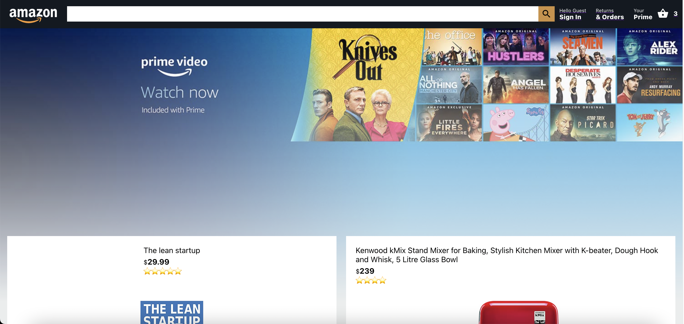
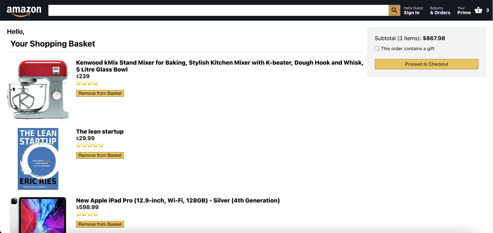
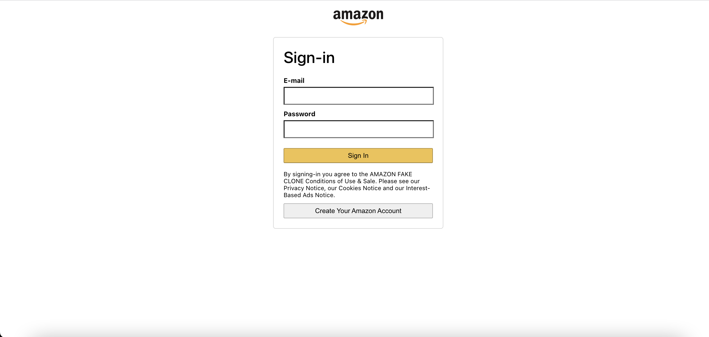
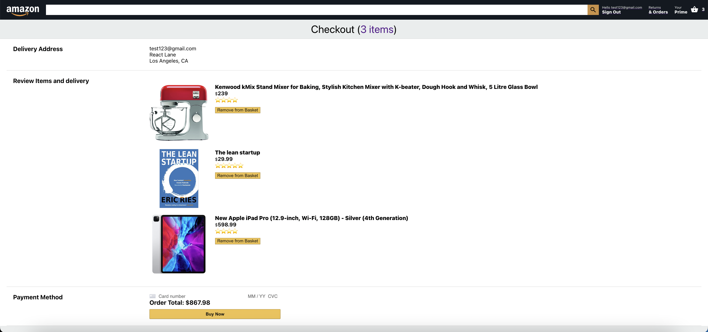
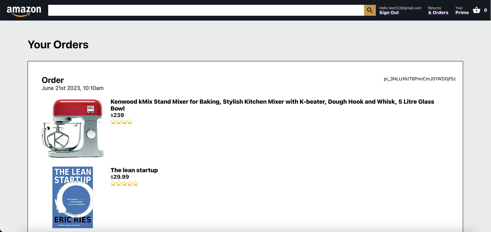

<h1 align='center'>Amazon Clone Website</h1>

An Amazon website clone with the basic functionality for the users to purchase products.

This project was built to practice ReactJS as well as learning the process of building a full-stack website from the beginning to the end. It resembles the older version of the Amazon website and many functionalities are not yet implemented as of right now.

### [Link to the website](https://clone-f93da.web.app/)

Note that none of the purchase on the website is real, you will not be charged for anything.

### Home Page

The home page displays several promoting products.

### Checkout Page

After adding several items to the basket, they can be reviewed in the checkout page.

### Login Page

You will need to login or create an account to purchase the item.

### Payment Page

Comfirm your purchasing items, address, and decide your payment method.

### Orders Page

At last purchased items can be viewed in the orders page.

### What is Next

- User profile page
- Updatable home page products
- Search page to browse more products
- Amazon prime page
- UI improvement to match the newest version of Amazon website
